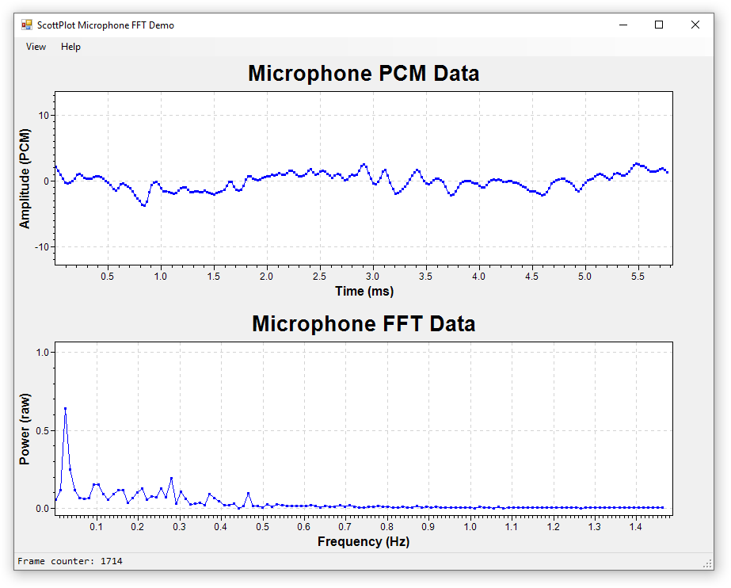

# Realtime Audio FFT with ScottPlot

This project is based on [swharden's](https://github.com/swharden) Csharp-Data-Visualization repo, specifically [this](https://github.com/swharden/Csharp-Data-Visualization/tree/master/projects/18-09-19_microphone_FFT_revisited) example. His example demonstrates a good use of his [ScottPlot](https://github.com/swharden/ScottPlot) Library.

All the action happens in Form1.cs It's a little easier to read and better documented than previous versions of this project.

### Screenshot

### Re-creating this Project from Scratch
Quoted from [swharden](https://github.com/swharden):

> These are the steps I did to make this project
> * I cloned [ScottPlot](https://github.com/swharden/ScottPlot) into [ScottPlot-2018-09-09/](ScottPlot-2018-09-09) so it will always work with this project even if the latest ScottPlot API changes.
> * Add Project (ScottPlot.csproj) to the solution
> * ScottPlotUC showed up in the toolbox, so I could drag/drop onto a form
> * Add reference to the `System.Numerics` assembly
> * Used NuGet to install `NAudio`
> * Used NuGet to install `Accord.Audio`
> * Fill out the code on Form1.cs
> * Run
