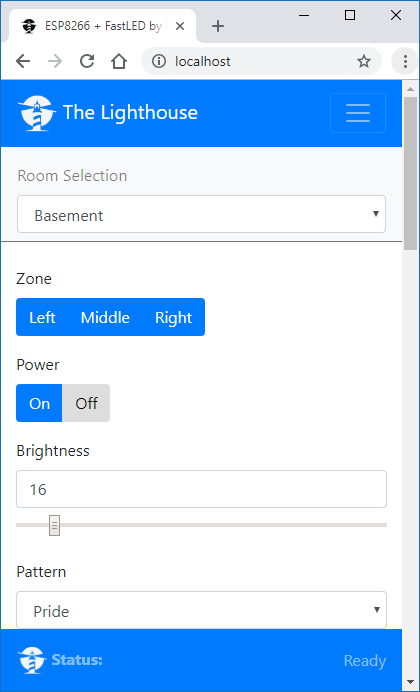

FastLED + ESP8266 + Dedicated Web Server
=========

Control many addressable LED strips with an ESP8266 via a web browser.

<B>NOTE:</B> If you would like to try the original master branch by jasoncoon, you can find it [here](https://github.com/Tiuipuv/esp8266-fastled-webserver). The instructions for the master are found in the Readme file.

Hardware Used
--------
| ESP-01 development board      | Addressable LED strip |
| ----------- | ----------- |
|       |        |


##### Addressable LED strip


Other hardware:

* [3.3V to 5V Logic Level Shifter](http://www.digikey.com/product-detail/en/texas-instruments/SN74HCT245N/296-1612-5-ND/277258)

Recommended by [Adafruit NeoPixel "Best Practices"](https://learn.adafruit.com/adafruit-neopixel-uberguide/best-practices) to help protect LEDs from current onrush:
* [1000µF Capacitor](http://www.digikey.com/product-detail/en/panasonic-electronic-components/ECA-1EM102/P5156-ND/245015)
* [300 to 500 Ohm resistor](https://www.digikey.com/product-detail/en/stackpole-electronics-inc/CF14JT470R/CF14JT470RCT-ND/1830342)

Features
--------
* Manage multiple Neopixel Strips
* Turn the NeoPixels on and off
* Adjust the brightness
* Change the display pattern
* Adjust the color

Web App
--------



Patterns are requested by the app from the ESP8266, so as new patterns are added, they're automatically listed in the app.

The web app is stored on the local server. The server files are found in the [Web Server root directory](https://github.com/Tiuipuv/esp8266-fastled-dedicated-webserver/tree/master/Web%20Server).

Audio services are found in the [Audio Server root directory](https://github.com/Tiuipuv/esp8266-fastled-dedicated-webserver/tree/master/Audio%20Server).

The web app is a single page app that uses [jQuery](https://jquery.com) and [Bootstrap](http://getbootstrap.com).  It has buttons for On/Off, a slider for brightness, a pattern selector, and a color picker (using [jQuery MiniColors](http://labs.abeautifulsite.net/jquery-minicolors)).  Event handlers for the controls are wired up, so you don't have to click a 'Send' button after making changes.  The brightness slider and the color picker use a delayed event handler, to prevent from flooding the ESP8266 web server with too many requests too quickly.

By hosting on a local server, there is virtual no limitation to file size / app scalability, and changes are very easy to manage.

Installing
-----------
#### Arduino setup
1. Install the Arduino IDE which can be [downloaded here](https://www.arduino.cc/en/main/software).
2. Add ESP8266 boards to Arduino Ide.
    * Click File > Preferences and copy and paste the URL "http://arduino.esp8266.com/stable/package_esp8266com_index.json" into the Additional Boards Manager URLs field.
    * Click OK. Click Tools > Boards: ... > Boards Manager.
    * Find and click on ESP8266 (using the Search function may expedite this). Click on Install.
    * Click on Close and then select your ESP8266 board from the Tools > Board: ... menu.

3. Clone [this repository](https://github.com/Tiuipuv/esp8266-fastled-webserver) using Git, or just download and extract as a zip.
4. Install the following libraries. They must either be downloaded from GitHub and placed in the Arduino 'libraries' folder, or installed as [described here](https://www.arduino.cc/en/Guide/Libraries) by using the Arduino library manager.
   * [FastLED](https://github.com/FastLED/FastLED)
   * [Arduino WebSockets](https://github.com/Links2004/arduinoWebSockets)
   * [ArduinoJson](https://github.com/bblanchon/ArduinoJson)
5. Create a `Secret.h` file in the ino sketch's folder. Add the following code, replacing with your ap and password list:
```
APList wifiAPs = {
  {"WIFI_SSID_NAME", "WIFI_PASSWORD"},
  {"WIFI_SSID_NAME2", "WIFI_PASSWORD2"} //optional, add as many as you want
};
```
6. Modify `RoomSpecific.h` to match your different rooms' led count and voltage requirements. Change this selection at upload time through the `CURRENT_ROOM` constant.
7. Upload code to your esp through selecting the appropriate com port. after the first upload, wifi upload should become available.

#### Web server setup
1. Install node js from [here](https://nodejs.org/en/) (LTS)

2. Start the server by running `node static_server.js` from the server folder.

3. Verify the server is running by typing http://localhost/ into your browser.

#### Audio server setup (optional, but recommended)

1. Install Visual Studio 2019, C sharp development packages
2. Use NuGet to install NAudio
3. Use NuGet to install Accord.Audio
4. Run the program
5. Verify using the UDP tester App included in the Web Server folder.

REST Web services
-----------------

The firmware implements basic [RESTful web services](https://en.wikipedia.org/wiki/Representational_state_transfer) using the ESP8266WebServer library.  Current values are requested with HTTP GETs, and values are set with POSTs using query string parameters.
